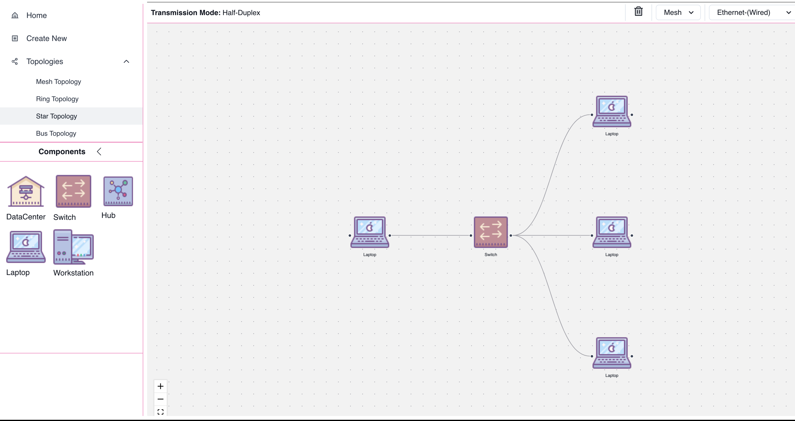

# Virtual Simulation Labs

Virtual Simulation Labs is an interactive tool designed to simulate TCP/IP networks, offering users a comprehensive platform to explore networking concepts and protocols. From designing custom network topologies to simulating data transmission, Virtual Simulation Labs provides an immersive learning experience for network enthusiasts and students alike.

## Key Features

### Topology Design

Virtual Simulation Labs allows users to create custom network topologies or choose from predefined arrangements such as star and mesh. With an intuitive interface powered by React Flow, users can easily add, connect, and configure network components to design their ideal network layout.

### Network Components

The application features a wide range of network components, including:

- **Endpoints**: Represented by Laptops, Data Centers, and Workstations, endpoints serve as sources and destinations for data transmission.
- **Switches**: Implementing switching tables, switches facilitate data forwarding between connected devices.
- **Hubs**: Simple devices that broadcast data to all connected devices, hubs are essential for simulating basic network architectures.

### Control Box

The Control Box provides users with detailed insights into selected components, including:

- **Physical Layer**: Visualizes the current network topology and connectivity between components.
- **Data Link Layer**: Displays information such as MAC addresses, received data, shared data, and error statistics.

### Data Sharing

Users can define various aspects of data transmission, including:

- **Data Input**: Specify data in binary format to be transmitted between network components.
- **Error Detection**: Choose from error detection techniques such as CRC, parity, and Hamming codes to detect transmission errors.
- **Error Correction**: Select error correction methods like Hamming codes to correct errors in transmitted data.
- **Framing Control**: Configure framing techniques such as bit stuffing and framing flags to structure transmitted data.

### Simulation

The simulation feature enables real-time data transmission between connected components. Through animated edges, users can observe the flow of data within the network, facilitating a deeper understanding of networking principles.

## Getting Started

To get started with Virtual Simulation Labs, follow these steps:

1. Clone the repository to your local machine.
2. Install dependencies using `yarn Install`.
3. Start the application using `yarn start`.
4. Explore the various features and functionalities available in the application.

## Screenshots

*Caption: Star topology and Mesh topology*

*Caption: Control box displaying component data and error information.*

*Caption: Frame visualization*

## Contributing

If you have ideas for new features, improvements, or bug fixes, please open an issue or submit a pull request.

